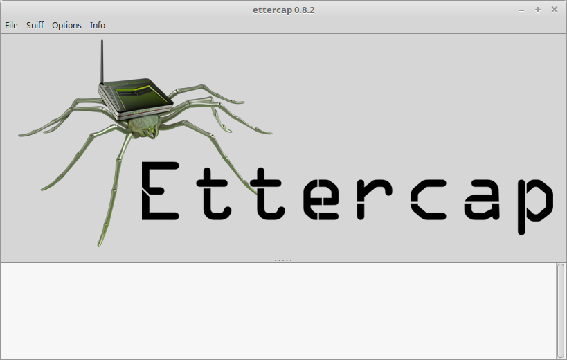
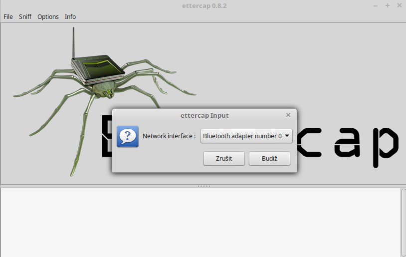
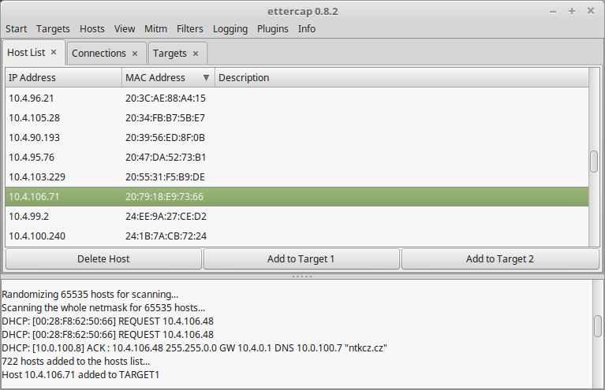
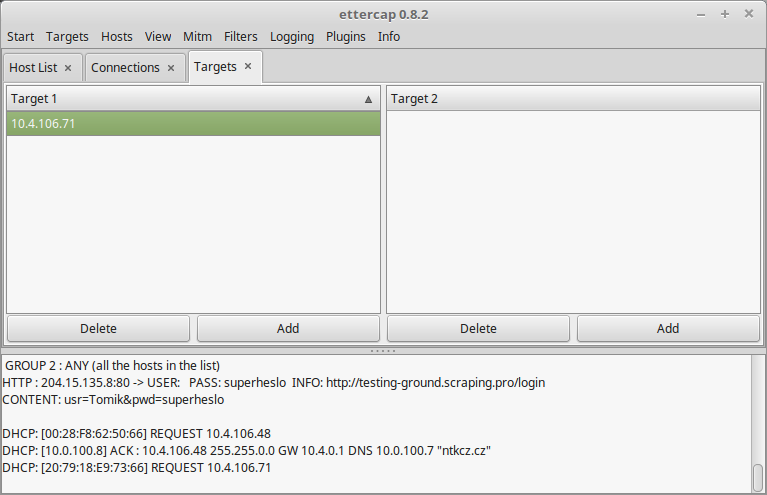
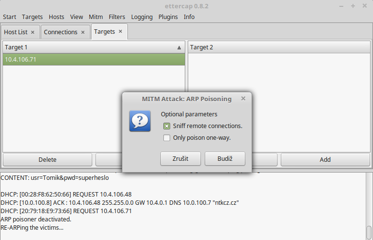
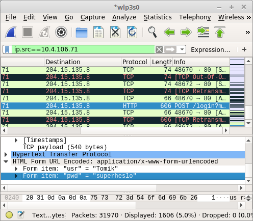
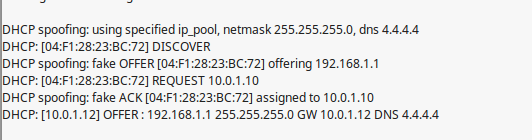

= Seminární práce na síťové útoky

=== Opakování

==== ARP

Address Resolution Protocol (zkratka ARP) označuje v informatice název služebního protokolu v počítačových sítích.
Protokol ARP slouží v rodině TCP/IP k získání linkové adresy síťového rozhraní protistrany ve stejné podsíti
pomocí známé IP adresy (např. v Ethernetu je získána tzv. MAC adresy). Protokol ARP je pro IPv4 definován v RFC 826.
Novější protokol IPv6 používá místo ARP podobný protokol NDP (Neighbor Discovery Protocol).

==== DHCP

DHCP protokol umožňuje prostřednictvím DHCP serveru nastavovat stanicím v počítačové síti sadu parametrů nutných pro komunikaci pomocí IP protokolu (tj. využívat rodinu protokolů TCP/IP).
Umožňuje předávat i doplňující a uživatelsky definované parametry. Významným způsobem tak zjednodušuje a centralizuje správu počítačové sítě
(například při přidávání nových stanic, hromadné změně parametrů, nebo pro skrytí technických detailů před uživateli).
DHCP servery mohou být sdruženy do skupin, aby bylo přidělování adres odolné vůči výpadkům.
Pokud klient některým parametrům nerozumí, ignoruje je.

==== Switch

Switche obsahují různé množství portů, do kterých se zapojí typicky ethernetové kabely,
které přepínač propojí a tím pádem propojí i zařízení nebo části sítě, na které kabely vedou.
Je to relativně jednoduché zařízení, které se stará o zasílání dat na úrovni paketů.
Jeho hlavním cílem je neomezování rychlosti v počítačové síti. Je to jakási “křižovatka, která
propouští vše co do ní vjede rychle a bezkolizně”. Vhledem k tomu, že switche pracují na nižších úrovních
datových přenosů, tak neberou v úvahu různá přístupová
práva a omezení a další bezpečnostní opatření.
Propojením pomocí switchů tedy vzniká homogenní síť, bezpečnost se tedy musí řešit buď na úrovni
topologie sítě, nebo na vyšších úrovních, např. pomocí VLAN nebo VPN.

== Mac flooding

Je to jeden z nejrozsáhlejších útoků na síti. Na rozdíl od jiných metod útočí zejména na switche v segmentu.
My si ukážeme, jak tento útok funguje.

Principem útoku je přepsat správné záznamy ve switchy a vynutit tzv. unicast flooding.
A tak odchytit komunikaci, která mohla být nějakým způsobem citlivá, protože se bude
přeposílat na místa, kam by neměla (k nám).

Switche si uchovávají MAC table, která mapuje jednotlivé MAC adresy na porty na switchy.
Tohle pomáhá switchy rychle přepínat na lokální síti na hosta, kterého hledá.
Výhoda v tomto je ta, že se data nešíří po celé síti ale jen tam kam mají.
V typickém MAC flooding útoku, útočník zahrne switch ethernetovými rámci,
každý obsahuje jinou zdrojovou MAC adresu. Cílem je spotřebovat omezenou paměť switche,
aby si nemohl pamatovat věci uložené v MAC table.

Útočník chce dostát toho efektu, že bude plná tabulka a další příchozí rámce, se začnou
odesílat na všechny porty. Následně může útočník odposlouchávat komunikaci například
wiresharkem a získat tak cenné informace od oběti, která je připojená na stejném segmentu sítě.
Útočník může následně pokračovat útokem zvaným ARP spoofing, který mu dovolí získat přístup k
privilegovaným datům jakmile se switch vzpamatuje.

==== Postup útoku

. Pomocí programu macof začněte plnit CAM tabulku switche

. Switch se po dane době přepne díky generovanému přetížení do režimu hubu

. Monitorujte síť a poslouchejte komunikaci ostatních klientů na síti

----
macof --help

# dulezite pro nas budou -i a -n
# -i je interface ze ktereho budeme utocit
# -n je pro cislo ktere udava kolik paketu budeme posilat
----

==== Obrana

Nastavit na switchi maximální počet možných adres které může mít switch připojen na portu.
Tímto zamezíme ukládání nových generovaných destinací, které se nám snaží
útočník postrčit.

== CISCO SPAN

Tento útok může útočník udělat hlavně pokud bude mit přístup ke switchi na lokální síti.
Je to spíše nastavení switche než nějaký kradmý způsob s průběhem klasického útoku.
Útočník přepne switch do režimu SPAN. Cisco switche tento mód podporují a jeho cílem
je monitorovat provoz na síti a ten následně přeposílat na jiný port, kde má správce sítě
stanici, na které provoz monitoruje.

Útočníkovi tedy stačí nastavit na switchi SPAN mode a nastavit port na kterém je
oběď připojená, aby rámce přeposílal na port k útočníkovi pod záminkou monitoringu.

==== Postup útoku

. vytvořit monitor session na switchi

. najít port ke kterému jsme připojeni jako útočník

. najít port ke kterému je připojená oběď

. zapnout si náš port jako destinaci pro příchozí rámce z portu oběti

. monitorovat komunikaci např pomocí aplikace wireshark

----
# Dostaneme se do configurace na switchi cisco
ena
conf

#
no monitor session 1

# port obeti ze ktereho utocnik bude preposilat komunikaci
monitor session 1 source interface <port obeti>

# port utocnika
monitor session 1 destiantion interface <port utocnika> encapsulation dot1q
----

==== Obrana

Je důležité spíše zabezbečit daný switch, aby se nemohl útočník připojit
na jeho konfigurační konzoli. Vždy se podívat zda tento mód náhodou není zaplý
a popřípadě tento mód vypnout.

== ARP SPOOFING

V této části si vysvětlíme co všechno APR spoofing může způsobit.
Jsou základní 3 výsledky, kterých můžete dosáhnout:

. Můžete odposlouchávat provoz na sít
  ** Tento výsledek je celkem jednoduchý na pochopení
  ** Pomocí jednoduchých nástrojů jako wireshark můžete následně sledovat veškerý provoz uvnitř sítě

. Můžete přerušit a změnit pakety pomocí man-in-the-middle útoku
  ** Lehce komplexnější typ útoku
  ** Díky ARP spoofingu přinutíte koncové zařízení v sítí přeposílat datový provoz skrze vás
  ** Následně přiajtá data změníte a pošlete dál do sítě jako by to byly vaše vlastní
  ** Pro koncové zařízení se tváříte jako brána sítě

. Můžete zahazovat pakety čímž zůsobíte denial-of-service (DOS) útok
  ** V podstatě téměř stejné jako druhý bod
  ** Jediný rozdíl je v tom, že místo měnění obsahu pakety zahazuete
  ** Tímto způsobem odříznete od určité služby (třeba internetu) koncové zařízení

Všech výsledků můžeme dosáhnout pomocí jednoduší, ale velice účinné, aplikace zvané Ettercap, kterou byste měli mít nainstalovanou na Kali linuxu v základu. Jako demonstraci vám ukázeme jak provést ARP spoofing, tak abyste odposlouchávali provoz na síti.

==== Postup útoku

* Připojení do sítě
** Zaprvé se musíte připojit do sítě, na kterou chcete útočit (pro vás být v zapojení uvedeném nahoře). Je to z důvodu, že útok se provádí na data tekoucí uvnitř sítě, nikoli na síť samotnou.

* Zapněte Ettercap
** Měli byste ho mít nainstalovaný na počítači, který má Kali linux

* Vyberte rozhraní, z kterého budete odposlouchávat
** Klikněte na tlačítko “Sniff” a vyberte “Unified sniffing”. Ukáže se vám vyskakovací okno s výběrem rozhraní, přes které budete odposlouchávat. Měli byste tam mít k dispozici všechny vaše připojená rozhraní.

* Výběr rozhraní
** Nyní byste měli ve spodní části Ettercapu měli vidět odposlouchávání a nahoře v kartách by se vám mělo objevit vícero možností jako například Targets, Hotst

* Najděte zařízení na síti
** Abychom našli zařízení, na které cheme útočit, musíme ho nejprve najít. V Ettercapu to jde poměrně jednoduše pomocí karty “Hosts” a pak v menu klikněte na “Scan for Hosts”. Pokud se vám rovnou nezobrazí výpis zařízení, tak v kartě “Hosts” klikněte na “Hosts list” a ukáže se vám výpis zařízení.

* Najděte cíl
** Po nalezení cíle (vašeho kolegy) si ho přidejte do Targetů. To můžete provést kliknutím na tlačítko “Add to Target 1”. Poté kliknete na kartu “Targets” a možnost “Current Targets”.

* Zapněte wireshark
** Ve wiresharku si filtrujte váš cíl na vašem vybraném rozhraní. Ve wiresharku se filtruje pomocí “ip.src==10.4.106.71” (použijte adresu odposlouchávaného kolegy)

* Zapněte ARP spoofing
** V kartě “Mitm” klikněte na “ARP poisoning” a vyskočí vám okno kde si vyberete sniffování vzdálených připojení.

* Voala
** Nyní se stačí dívat do wiresharku a můžete vidět veškernou komunikaci vašeho cíle do vzdálených sítí. Pro příklad jsme odposlechli ve wiresharku přihlašovací údaje na nezabezpečenou HTTP stránku našeho cíle.

==== Obrana

Je zde open source řešení a to ArpON “ARP handler inspection”.
Je to daemon, který zabezpečuje ARP protokol za účelem obrany proti útokům:

. Man In The Middle (MITM)
. ARP Cache Poisoning
. ARP Poison Routing (APR) attacks

== DHCP SPOOFING

Principem útoku je zneužití procesu přidělování síťových informací pomocí DHCP protokolu.
Útočník musí dosáhnout toho, aby klient dostal síťové údaje od jeho DHCP serveru a ne od toho reálného.
Jednou z možností je být nejrychlejší, ale na to se však nedá spolehnout a obzvláště ne, pokud už počítač byl někdy v síti připojení.
Útočník má možnosti jak to obejít: Buď vyčerpat všechny IP adresy, poskytované reálného DHCP serveru,
takže na síti bude odpovídat na requesty pouze jeho server.
Nebo vyřadit z provozu reálný server pomocí DoS útoku například.
Pro útočníka nestačí změnit pouze adresu brány oběti, protože by sice mohl kontrolovat pakety směřující na bránu,
ale už ne v opačném směru. Jsou způsoby jak kontrolovat oba směry komunikace.
Buď by utočník musel vzít úlohu NATu a vykonávat překlady pro komunikaci.
Nebo možnost je podstrčit falešný DNS server. Z útočníka se stává více méně takový “proxy server” pro své oběti.

==== Postup útoku

. otevřte Ettercap (tato část je na Kali zařízení)

. karta “Sniff” a zaklikněte možnost “Unified sniffing...”

. vyberte rozhraní přes které chcete odposlouchávat

. karta “Mitm” a možnost “DHCP spoofing”

. vyplňte rámec adres, které server bude rozdávat, masku a adresu DNS

. DHCP spoofing běží a čeká na možnost někomu podstrčit svou adresu

. zažádejte o přidělení adresy (na druhém zařízení)

Měli byste v Ettercapu vidět, že zařízení si žádá o adresu váš DHCP server ji přiděluje oběti.
Pro zpětnou kontrolu se můžete podívat do configurace rozhraní, které bylo napadeno jestli dostalo údaje od vašho serveru.
Jako brána by měl být počítač útočníka, takže když se pokusíte například pingnout někam (pro demonstraci),
tak by to měl být schopem útočník zachytit na svém zařízení přes wireshark.

==== Obrana

Proti DHCP spoofingu se lze bránit DHCP snoopingem. To je mechanismus na switchi, který dovoluje jen daným portům
posílat DCHP response. Pokud se útočník tedy připojí na port, na kterém není povoleno odesílat DHCP response, je
port automaticky zablokován ke komunikaci. Tedy útočník musí mít pro provedení útoku přístup pouze k danému portu switche,
na kterém je možné provozovat DHCP server.

----

# enable mode
ena

# config mode
conf

# enable DHCP snooping
ip dhcp snooping

# set it up on interface
interface gigabitethernet 0/3
ip dhcp snooping trust

----
